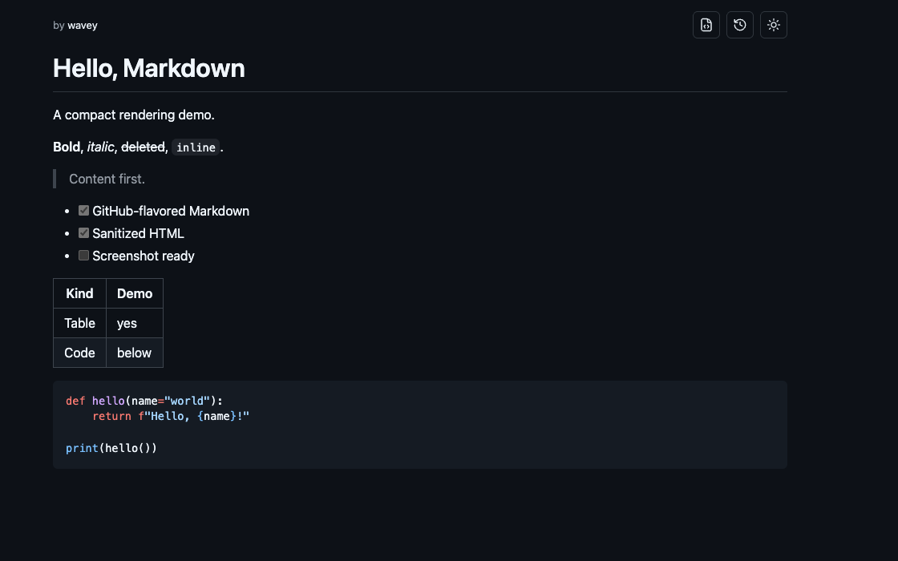

# Wavey Gist

[](https://github.com/wavey0x/gist/actions/workflows/ci.yml)

A small self-hosted Markdown gist renderer. API keys create and update gists;
anyone with a random gist URL can read the rendered page and raw source.



## Features

- Server-rendered public gist pages.
- GitHub-flavored Markdown rendering.
- Sanitized stored HTML.
- Immutable revision URLs.
- Read-only rendered/raw browser views.
- Key-backed private list of gists created by the logged-in API key.
- Scoped API keys.
- SQLite persistence by default.

## Architecture

This repository has two deployable apps:

- `ui/`: Next.js frontend for public gist pages.
- `api/`: Flask backend for persistence, API keys, rendering, sanitization, and
  gist API routes.

The frontend fetches rendered gist payloads from the backend. The backend stores
Markdown, sanitized rendered HTML, revision snapshots, API keys, web sessions,
and rate-limit events in a dedicated SQLite database.

## Local Development

Requirements:

- Node.js and npm.
- Python 3.10+.
- `uv`.

Install backend dependencies:

```sh
cd api
uv sync
npm ci
cp .env.example .env
```

Run the backend:

```sh
cd api
SQLITE_DB_PATH=.local/gists.sqlite3 \
PUBLIC_GIST_BASE_URL=http://localhost:3000 \
uv run flask --app 'gist_api.app:create_app' run --port 3001
```

Install frontend dependencies:

```sh
cd ui
npm ci
cp .env.example .env
```

Run the frontend:

```sh
cd ui
GIST_API_BASE_URL=http://localhost:3001 npm run dev
```

Open `http://localhost:3000`.

## Create An API Key

In another terminal, create an admin key:

```sh
cd api
SQLITE_DB_PATH=.local/gists.sqlite3 uv run admin keys create \
  --name admin \
  --github-login <github_login> \
  --role admin
```

Save the printed key securely. Logged-in users can also view their current key
from the account page.

## Create A Gist

Use the key from the previous step:

```sh
curl -sS http://localhost:3001/api/v1/gists \
  -H "Authorization: Bearer $GIST_API_KEY" \
  -H "Content-Type: application/json" \
  -d '{"title":"Hello","markdown":"# Hello\n\nThis is a gist."}'
```

Open the returned `url` in the browser.

## List Your Gists

Open `http://localhost:3000/login`, enter the API key once, then visit
`/me`. The browser stores an HttpOnly `wg_session` cookie, and the `/me` page
can disclose the current API key after the session is authenticated.

## Configuration

Backend environment variables:

| Name | Default | Description |
| --- | --- | --- |
| `SQLITE_DB_PATH` | required | Path to the dedicated SQLite database. |
| `PUBLIC_GIST_BASE_URL` | deployment-specific | Public frontend base URL used in API responses. |
| `PORT` | `3001` | Backend port when using the module entrypoint. |
| `MAX_MARKDOWN_BYTES` | `1048576` | Maximum Markdown payload size. |
| `MAX_REQUEST_BYTES` | `MAX_MARKDOWN_BYTES + 2048` | Maximum JSON request body size accepted by Flask. |
| `ALLOW_EMPTY_MARKDOWN` | `false` | Allow empty Markdown documents. |
| `SQLITE_BUSY_TIMEOUT_MS` | `5000` | SQLite busy timeout. |
| `API_WRITE_LIMIT_PER_24H` | `150` | Write limit per key and source IP. |
| `API_AUTH_FAILURE_LIMIT_PER_MINUTE` | `20` | Auth failure limit per source IP. |
| `GIST_HIGHLIGHT_TIMEOUT_SECONDS` | `8` | Syntax highlighter subprocess timeout. |
| `GIST_MAX_HIGHLIGHT_BLOCK_BYTES` | `204800` | Maximum bytes for one highlighted code block. |
| `GIST_MAX_HIGHLIGHT_BLOCKS` | `64` | Maximum highlighted code blocks per render. |
| `GIST_MAX_HIGHLIGHT_TOTAL_BYTES` | `524288` | Maximum total highlighted code bytes per render. |

Frontend environment variables:

| Name | Default | Description |
| --- | --- | --- |
| `GIST_API_BASE_URL` | `http://localhost:3001` | Backend base URL used by server-rendered pages. The hosted Wavey frontend falls back to `https://api.wavey.info` when served from `gist.wavey.info`. |
| `WAVEY_API_BASE_URL` | unset | Backward-compatible alias for existing Wavey deployments. |
| `SITE_BASE_URL` | deployment-specific | Canonical public frontend base URL. |
| `GIST_BRAND_NAME` | `wavey` | Brand name shown before `gist` in the compact gist-page brand mark. |
| `GIST_SHOW_BRANDING` | `false` | Show the compact gist-page brand mark. Use `true`, `1`, `yes`, or `on` to enable it. |

## Admin CLI

Run admin commands from `api/` with `SQLITE_DB_PATH` set.

```sh
uv run admin keys create --name <name>
uv run admin keys create --name <name> --github-login <github_login>
uv run admin keys create --name <name> --role admin --github-login <github_login>
uv run admin keys list
uv run admin keys revoke <key_prefix_or_id>
uv run admin keys rotate <key_prefix_or_id> --name <new_name>
uv run admin keys rotate <key_prefix_or_id> --github-login <github_login>
uv run admin gists rerender --all
```

User keys can create, update, and read raw gist API payloads. Admin keys add
`gist:delete`, which can delete only gists originally created by that key.

## API

Base path:

```text
/api/v1
```

Routes:

```text
GET    /api/v1/healthz
POST   /api/v1/auth/session
GET    /api/v1/auth/session
DELETE /api/v1/auth/session
GET    /api/v1/me/gists
DELETE /api/v1/me/gists/{gist_id}
POST   /api/v1/gists
GET    /api/v1/gists/{gist_id}
GET    /api/v1/gists/{gist_id}/render
GET    /api/v1/gists/{gist_id}/revisions/{revision_number}/render
PATCH  /api/v1/gists/{gist_id}
DELETE /api/v1/gists/{gist_id}
```

Protected routes use:

```text
Authorization: Bearer <api_key>
```

The web-session routes use the `wg_session` HttpOnly cookie minted from an API
key with `gist:read`.

Delete routes require `gist:delete` and only delete gists whose first revision
was created by the authenticated key. A non-owned gist returns `404`.

Public render routes do not require auth because anyone with the random gist
URL can view the rendered page and raw Markdown source.

## Deployment

For a small self-hosted deployment, run:

- the backend with Gunicorn or another WSGI server;
- the frontend with a Next.js host;
- a dedicated SQLite database path on persistent storage;
- a reverse proxy or platform routing rule that exposes the backend API and the
  frontend on your chosen domains.

Back up the SQLite database before upgrades. If the database uses WAL mode,
include the database, WAL, and shared-memory files or use SQLite's online
backup tooling.

Run the backend service with `umask 077` and keep the SQLite database directory
owned by the service user. If the backend sits behind a reverse proxy, configure
that proxy to append or overwrite `X-Forwarded-For`; the API only trusts
forwarded client IPs from loopback proxy remotes and uses the rightmost valid
forwarded IP for rate limits.

## Security Model

Gist URLs are bearer-capability URLs: anyone with the URL can read that gist.
The private `/me` page is backed by the current web session, shows the current
API key, and lists only gists created by that key. There is no public listing,
account system, editor, comments, analytics, or social graph.

The backend sanitizes rendered HTML before storage. API keys are stored in
cleartext for account-page disclosure; web session tokens are stored only as
hashes. Do not log Markdown bodies, rendered HTML, authorization headers,
session cookies, or raw API keys in production.

## License

MIT
